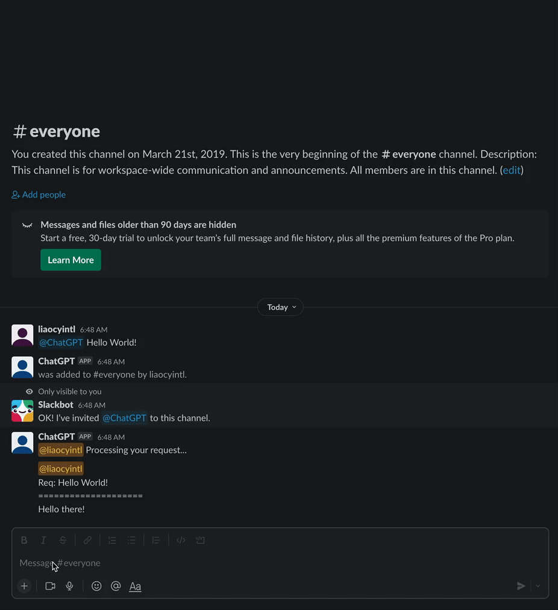
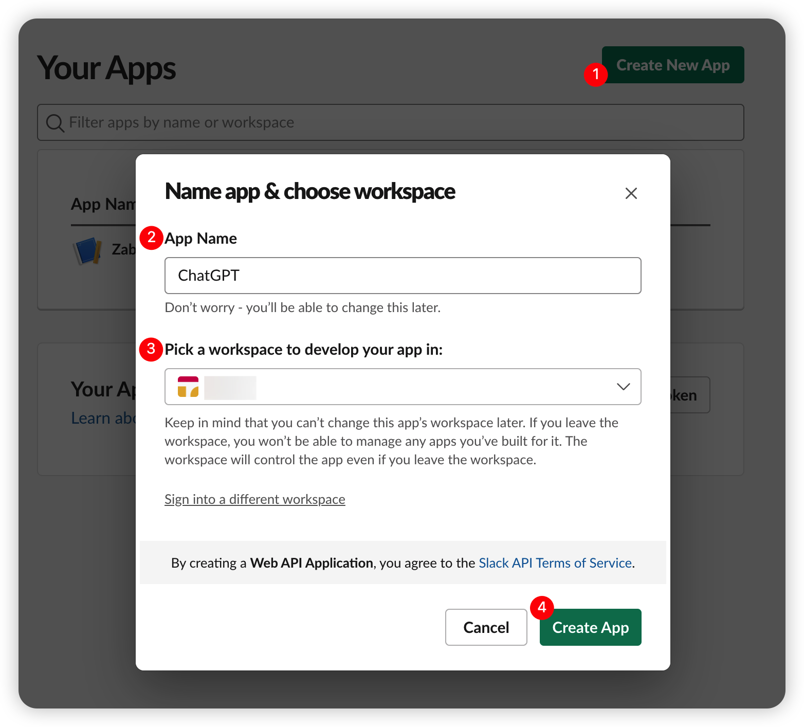
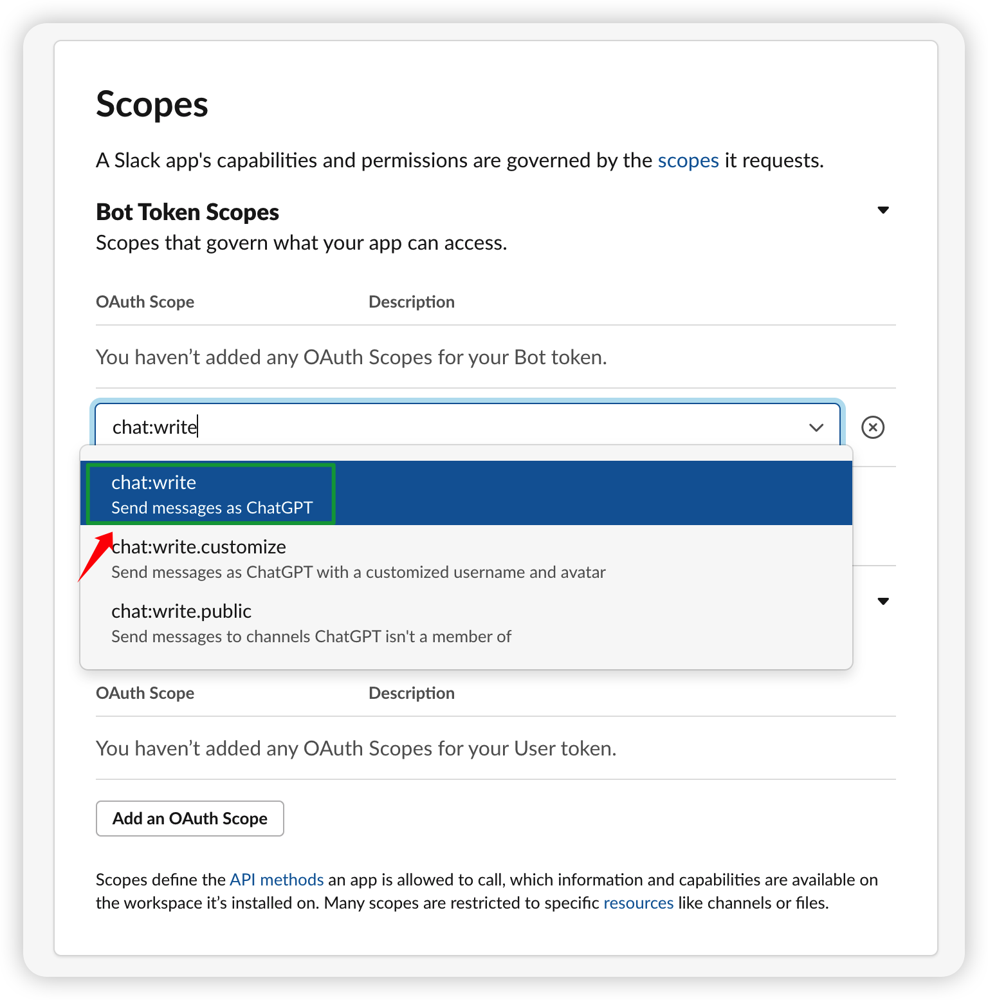
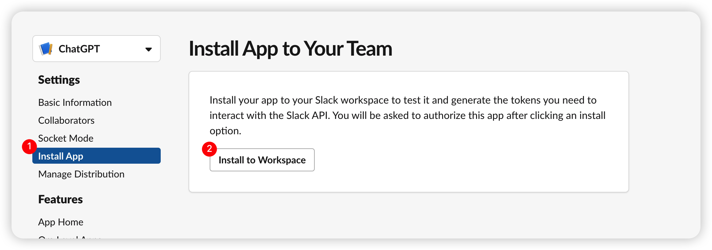
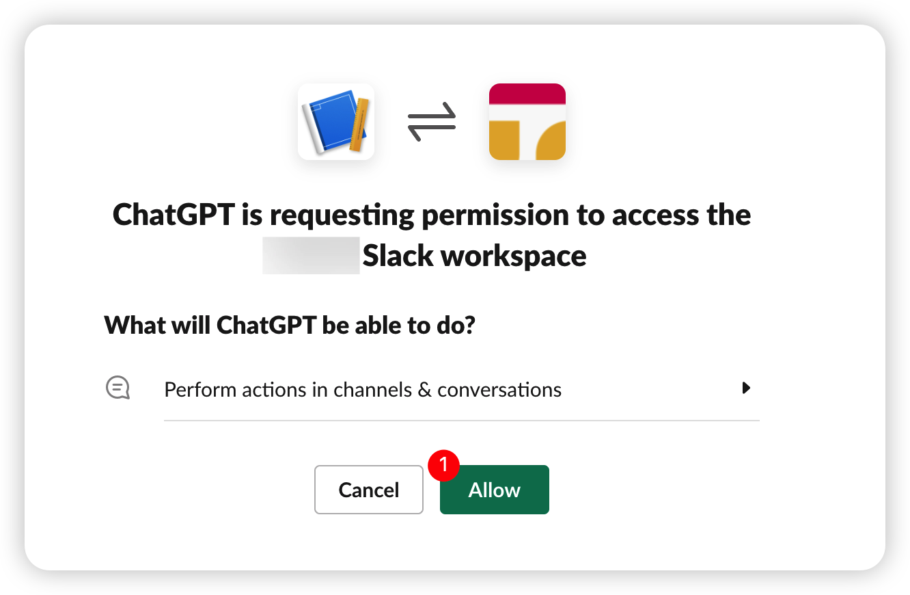
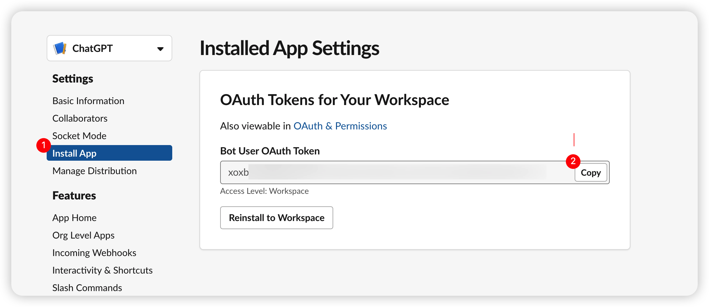
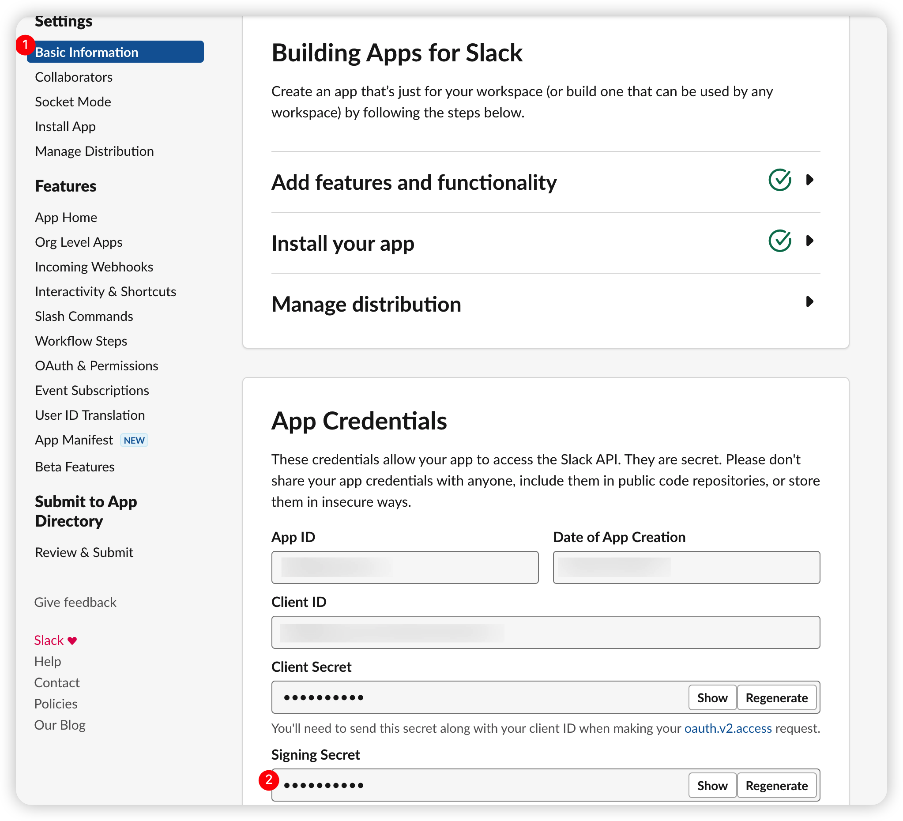
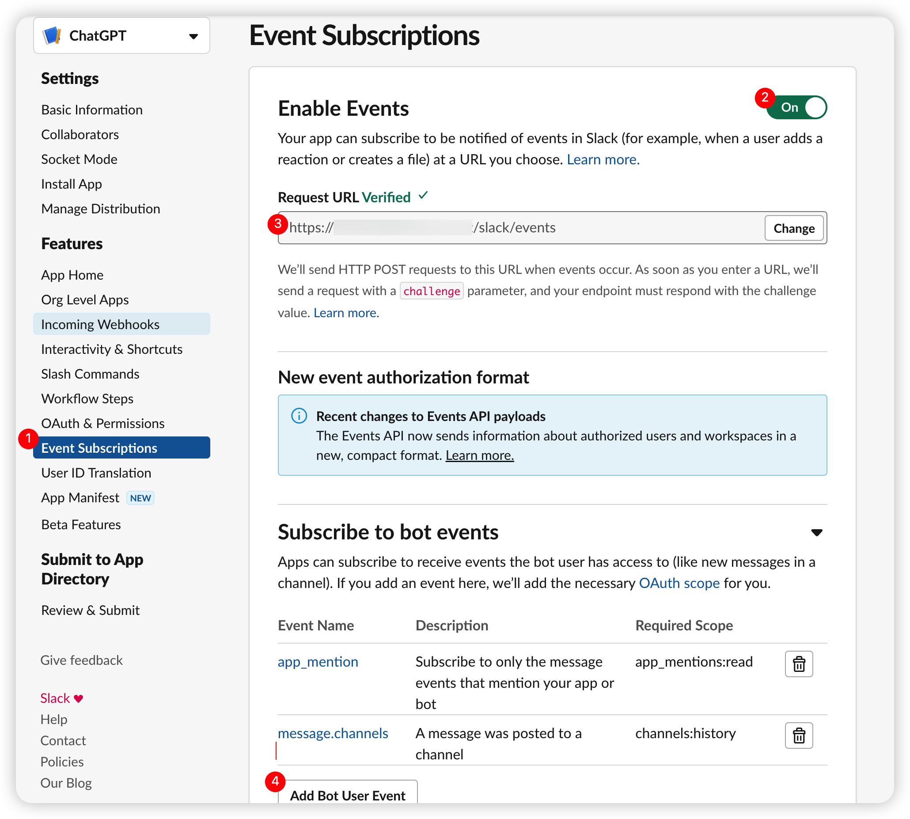

# Introduction
A Python based Slack Chatbot that aggregates [ChatGPT](https://openai.com/blog/chatgpt) responses to Slack messages.



# Quick Start

## Register Slack App

1. Go to https://api.slack.com/apps and create a new app



2. Go to "OAuth & Permissions" and add the following scopes to the "Bot Token Scopes" section by clicking "Add an OAuth Scope" button:
- `chat:write`: a [scope](https://api.slack.com/scopes/chat:write) to grant your app the permission to post messages in channels it's a member of.



3. Go to "Install App" and click "Install App to Workspace" button. You will be redirected to the installation page. Click "Allow" button to grant the permission to your app.





4. Go to "OAuth & Permissions" and copy the "Bot User OAuth Access Token" value. You will need it later.



5. Go to "Basic Information" and copy the "Signing Secret" value. You will need it later.



6. Go to "Event Subscriptions" and enable events. You will need to specify a Request URL for receiving events from Slack. 
You should subscribe to the following events:
- `app_mention`: a [type](https://api.slack.com/events/app_mention) of event that occurs when a user mentions your app in a channel.
- `message.channels`: a [type](https://api.slack.com/events/message.channels) of event that occurs when a message is sent to a channel.

Note: if you have no public IP address, you can use [ngrok](https://ngrok.com/) to expose a local server to the internet.



REFERENCES: 
- [Create a Slack app](https://github.com/slackapi/python-slack-sdk/blob/main/tutorial/01-creating-the-slack-app.md)

## Clone the repository

```bash
git clone https://github.com/liaocyintl/PySlackChatGPT.git
```

## Setup `config.py`

1. Copy and rename `src/config.py.example` to `src/config.py`

```bash
cp src/config.py.example src/config.py
```

2. Update the following values in `src/config.py`:
- `SLACK_BOT_TOKEN`: the value of "Bot User OAuth Access Token" you copied in the previous step
- `SLACK_SIGNING_SECRET`: the value of "Signing Secret" you copied in the previous step
- `OPENAI_API_KEY`: obtain an API key from [OpenAI API keys](https://platform.openai.com/account/api-keys)
- `CHATGPT_MODEL`: the module name of ChatGPT (default is `gpt-3.5-turbo`)

## Run the Bot

### Run on Docker (Recommended)

1. Build Docker Image

```
docker build -t pyslackchatgpt:1.0.0 .
```

2. Confirm Docker Image (Optional)

Make sure the image `pyslackchatgpt:1.0.0` is listed.
```
docker images
```


3. Run Docker Container

Note: You can change the port mapping number 9999 to any other port number you like.

```
docker run -d -p 9999:9999 --name pyslackchatgpt pyslackchatgpt:1.0.0
```

4. Confirm Docker Container Log (Optional)

```
docker logs -f pyslackchatgpt
```

### Run on Local


1. Setup Python Environment

```
python -m venv venv
```

2. Activate Python Environment

```
source venv/bin/activate
```

3. Install Python Dependencies

```
pip install -r requirements.txt
```

4. Run the Bot

```
python main.py
```

# Release Notes

## v1.0.0 (2021-03-04)
The first available version of the PySlackChatGPT.